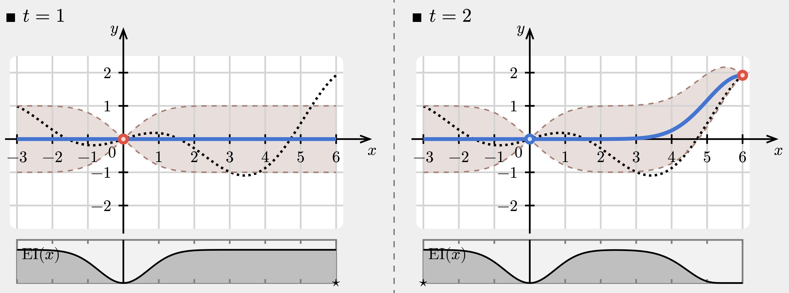
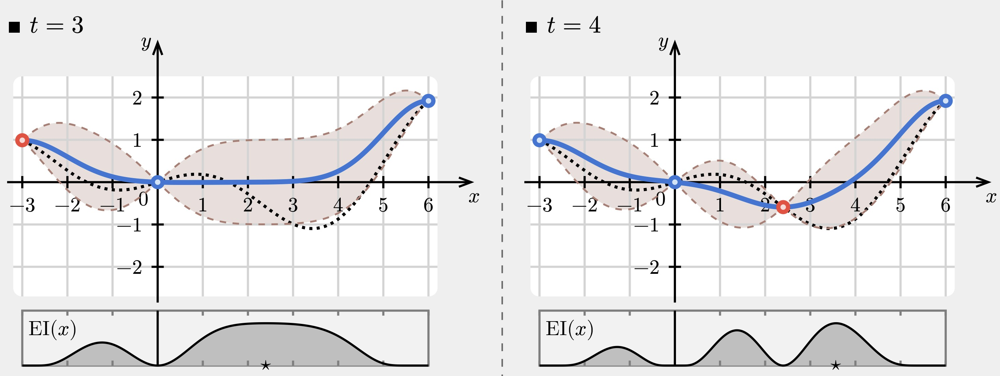
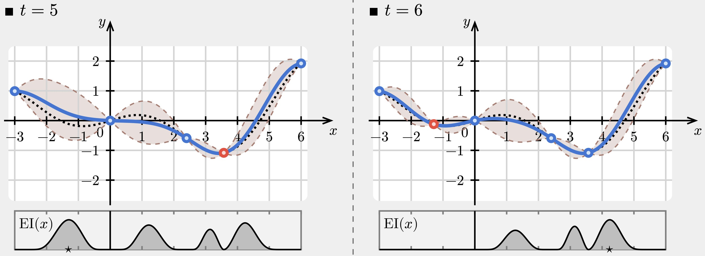
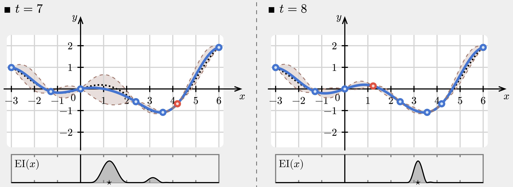
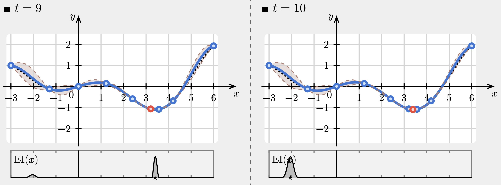

```{r setup, include=FALSE}
knitr::opts_chunk$set(echo = FALSE)

library(ggplot2)
library(mvtnorm)
library(gplite)
library(gridExtra)
library(plgp)
library(data.table)
library(plotly)

set.seed(78949084)
```

# Group Sequential Clinical Trials - Refresher

## Planning an RCT

A randomised clinical trial compares a treatment, $T$, to a control, $C$

## Planning an RCT

A randomised clinical trial compares a treatment, $T$, to a control, $C$

Frequentist operating characteristics are controlled:

- type I error rate, $\alpha$  
- type II error rate, $\beta$ (or power, $1-\beta$)

## Planning an RCT

A randomised clinical trial compares a treatment, $T$, to a control, $C$

Frequentist operating characteristics are controlled:

- type I error rate, $\alpha$  
- type II error rate, $\beta$ (or power, $1-\beta$)

If $\theta$ is a random variable denoting some measure of difference $T-C$:  

| One-sided hypothesis | Statement      |
|-----------------|---------------------|
| Null hypothesis | $H_0: \theta \le 0$ |
| Alt hypothesis  | $H_a: \theta > 0$   |

## Planning an RCT

Fixed sample test for some clinically meaningful difference $\delta$:

1. Choose $c$ such that $P(Z>c\,|\,\theta=0)=\alpha$  
2. Choose sample size $n$ such that $P(Z > c\,|\,\theta=\delta) \ge 1-\beta$


Reject $H_0$ if $Z>c$.

## Group sequential design

Multiple analyses are performed throughout the trial.

## Group sequential design

Multiple analyses are performed throughout the trial.

If we have $K$ total analyses, one possible design, $D$, defines boundaries:

- $\boldsymbol{\ell} = \{\ell_1, \ell_2, \dots,\ell_K\}$
- $\mathbf{u} = \{u_1, u_2, \dots,u_K\}$

## Group sequential design

Multiple analyses are performed throughout the trial.

If we have $K$ total analyses, one possible design, $D$, defines boundaries:

- $\boldsymbol{\ell} = \{\ell_1, \ell_2, \dots,\ell_K\}$
- $\mathbf{u} = \{u_1, u_2, \dots,u_K\}$

And a sample size, $n$, constant at each stage:

- $\mathbf{n}=\{n_1, \dots, n_K\}$ where $n_1=\dots=n_K$ and
- each group $T_k$ and $C_k$ has size $\frac{n}{2}$

## Group sequential design

Multiple analyses are performed throughout the trial.

If we have $K$ total analyses, one possible design, $D$, defines boundaries:

- $\boldsymbol{\ell} = \{\ell_1, \ell_2, \dots,\ell_K\}$
- $\mathbf{u} = \{u_1, u_2, \dots,u_K\}$

And a sample size, $n$, constant at each stage:

- $\mathbf{n}=\{n_1, \dots, n_K\}$ where $n_1=\dots=n_K$ and
- each group $T_k$ and $C_k$ has size $\frac{n}{2}$

If we naively test, for instance, all upper bounds set such that $P(Z>c\,|\,\theta=0)=\alpha$ as defined previously, **type I error will be inflated**. 

## Group sequential design

Multiple analyses are performed throughout the trial.

If we have $K$ total analyses, one possible design, $D$, defines boundaries:

- $\boldsymbol{\ell} = \{\ell_1, \ell_2, \dots,\ell_K\}$
- $\mathbf{u} = \{u_1, u_2, \dots,u_K\}$

And a sample size, $n$, constant at each stage:

- $\mathbf{n}=\{n_1, \dots, n_K\}$ where $n_1=\dots=n_K$ and
- each group $T_k$ and $C_k$ has size $\frac{n}{2}$

If we naively test, for instance, all upper bounds set such that $P(Z>c\,|\,\theta=0)=\alpha$ as defined previously, **type I error will be inflated**. 

<div class="centered blue"><b>Boundary critical values must be adjusted to control for this.</b></div>

## Group sequential design

<div style="float: left; width: 73.47%;">

```{r}
boundaries <- data.frame(
  x = c(5, 3, 2, 1.5, 1),
  y = c(-2, -1, 0, 0.5, 1),
  k_analysis = c(1, 2, 3, 4, 5)
)

ggplot(data = boundaries) +
  geom_ribbon(aes(x = k_analysis, ymin = x, ymax = Inf), fill = "red", alpha = 0.1) +
  geom_ribbon(aes(x = k_analysis, ymin = y, ymax = -Inf), fill = "red", alpha = 0.1) +
  geom_ribbon(aes(x = k_analysis, ymin = x, ymax = y), fill = "darkgreen", alpha = 0.2) +
  
  geom_line(aes(x = k_analysis, y = y), color = "red") +
  geom_line(aes(x = k_analysis, y = x), color = "blue") +
  
  geom_point(aes(x = k_analysis, y = y)) +
  geom_point(aes(x = k_analysis, y = x)) +
  
  annotate("label", x = 2, y = 1, label = "Continue trial") +
  annotate("label", x = 3, y = 4, label = "Stop for efficacy (reject null)") +
  annotate("label", x = 3, y = -1.5, label = "Stop for futility (fail to reject null)") +
  
  ylab("Test statistic, Z") +
  xlab("Analysis number, k") +
  
  scale_x_continuous(limits = c(0.5,5.3), breaks = c(1, 2, 3, 4, 5)) +
  scale_y_continuous(limits = c(-3, 6)) + 
  
  theme_bw()
```

</div>

<div class="centered blue" style="float: right; width: 25%;">
</div>

## Group sequential design

<div style="float: left; width: 73.47%;">

```{r}
boundaries <- data.frame(
  x = c(5, 3, 2, 1.5, 1),
  y = c(-2, -1, 0, 0.5, 1),
  k_analysis = c(1, 2, 3, 4, 5)
)

ggplot(data = boundaries) +
  geom_ribbon(aes(x = k_analysis, ymin = x, ymax = Inf), fill = "red", alpha = 0.1) +
  geom_ribbon(aes(x = k_analysis, ymin = y, ymax = -Inf), fill = "red", alpha = 0.1) +
  geom_ribbon(aes(x = k_analysis, ymin = x, ymax = y), fill = "darkgreen", alpha = 0.2) +
  
  geom_line(aes(x = k_analysis, y = y), color = "red") +
  geom_line(aes(x = k_analysis, y = x), color = "blue") +
  
  geom_point(aes(x = k_analysis, y = y)) +
  geom_point(aes(x = k_analysis, y = x)) +
  
  annotate("label", x = 2, y = 1, label = "Continue trial") +
  annotate("label", x = 3, y = 4, label = "Stop for efficacy (reject null)") +
  annotate("label", x = 3, y = -1.5, label = "Stop for futility (fail to reject null)") +
  
  ylab("Test statistic, Z") +
  xlab("Analysis number, k") +
  
  scale_x_continuous(limits = c(0.5,5.3), breaks = c(1, 2, 3, 4, 5)) +
  scale_y_continuous(limits = c(-3, 6)) + 
  
  theme_bw()
```

</div>

<div class="centered blue" style="float: right; width: 25%;">
<b> Problem: an _infinite_ number of possible designs! </b>
</div>

# Gaussian processes: Motivating problem

## Non-linear regression

Given $n$ data points $\{x_i, y_i\}_{i=1}^n \xrightarrow{\text{Predict}} (x_{\texttt{new}}, y_{\texttt{new}})$

```{r}
x <- seq(from = 0, to = 2*pi + 0.2, length.out = 50)
y <- sin(x) 


ggplot() +
  geom_point(mapping = aes(x = x[c(2, 10, 14, 33, 45)], y = y[c(2,10,14,33, 45)]), 
             color = "purple",
             size = 2.5) +
  labs(
    title = "Nonlinear function",
    x = expression(x),
    y = expression(y)
  ) +
  xlim(-0.1,6.5) +  
  ylim(-1.2,1.2) +  
  theme_bw()
```

## Non-linear regression

Given $n$ data points $\{x_i, y_i\}_{i=1}^n \xrightarrow{\text{Predict}} (x_{\texttt{new}}, y_{\texttt{new}})$

```{r}
x <- seq(from = 0, to = 2*pi + 0.2, length.out = 50)
y <- sin(x) 


ggplot() +
  geom_point(mapping = aes(x = x[c(2, 10, 14, 33, 45)], y = y[c(2,10,14,33, 45)]), 
             color = "purple",
             size = 2.5) +
  geom_linerange(aes(x = 3, ymin = -0.5, ymax = 0.5), linewidth=0.7) +
  geom_label(aes(x = 3, y = 0, label = "?")) +
  labs(
    title = "Nonlinear function",
    x = expression(x),
    y = expression(y)
  ) +
  xlim(-0.1,6.5) +  
  ylim(-1.2,1.2) +    
  theme_bw()
```

## Non-linear regression

<div style="float: left; width: 73.47%;">

Given $n$ data points $\{x_i, y_i\}_{i=1}^n \xrightarrow{\text{Predict}} (x_{\texttt{new}}, y_{\texttt{new}})$

```{r}
x <- seq(from = 0, to = 2*pi + 0.2, length.out = 50)
y <- sin(x) 

x2 <- seq(from = 0, to = 2*pi + 0.2, length.out = 500)
y2 <- sin(x2) 

gp <- gp_init(  
  # A squared exponential (aka Gaussian aka RBF) kernel
  cfs = cf_sexp(),  
  
  # Assume Gaussian distributed errors
  lik = lik_gaussian(), 
  
  # Use the full covariance (i.e., do not approximate)
  method = method_full() )

fit <- gp_optim(gp, x = x[c(2, 10, 14, 33, 45)], y = y[c(2,10,14,33, 45)],
                verbose = FALSE)

preds <- gp_pred(fit, xnew = x2, var = TRUE)

mean <- preds$mean
var <- preds$var

ggplot() +
  geom_line(aes(x = x2, y = mean), color = "darkorange", linewidth = 1) +
  geom_ribbon(aes(x = x2, ymin = mean+10*var, ymax = mean-10*var), 
              fill = "darkorange",
              alpha = 0.3) +
  geom_point(mapping = aes(x = x[c(2, 10, 14, 33, 45)], y = y[c(2,10,14,33, 45)]), 
             color = "purple",
             size = 2.5) +
  labs(
    title = "Nonlinear function",
    x = expression(x),
    y = expression(y)
  ) +
  xlim(-0.1,6.5) +  
  ylim(-1.2,1.2) +  
  theme_bw()
```

</div>

<div class="centered blue" style="float: right; width: 25%;">
</div>

## Non-linear regression

<div style="float: left; width: 73.47%;">

Given $n$ data points $\{x_i, y_i\}_{i=1}^n \xrightarrow{\text{Predict}} (x_{\texttt{new}}, y_{\texttt{new}})$

```{r}
x <- seq(from = 0, to = 2*pi + 0.2, length.out = 50)
y <- sin(x) 

x2 <- seq(from = 0, to = 2*pi + 0.2, length.out = 500)
y2 <- sin(x2) 

gp <- gp_init(  
  # A squared exponential (aka Gaussian aka RBF) kernel
  cfs = cf_sexp(),  
  
  # Assume Gaussian distributed errors
  lik = lik_gaussian(), 
  
  # Use the full covariance (i.e., do not approximate)
  method = method_full() )

fit <- gp_optim(gp, x = x[c(2, 10, 14, 33, 45)], y = y[c(2,10,14,33, 45)],
                verbose = FALSE)

preds <- gp_pred(fit, xnew = x2, var = TRUE)

mean <- preds$mean
var <- preds$var

ggplot() +
  geom_line(aes(x = x2, y = mean), color = "darkorange", linewidth = 1) +
  geom_ribbon(aes(x = x2, ymin = mean+10*var, ymax = mean-10*var), 
              fill = "darkorange",
              alpha = 0.3) +
  geom_point(mapping = aes(x = x[c(2, 10, 14, 33, 45)], y = y[c(2,10,14,33, 45)]), 
             color = "purple",
             size = 2.5) +
  labs(
    title = "Nonlinear function",
    x = expression(x),
    y = expression(y)
  ) +
  xlim(-0.1,6.5) +  
  ylim(-1.2,1.2) +  
  theme_bw()
```

</div>

<div class="centered blue" style="float: right; width: 25%;">
<b> Can all be done with Gaussian distributions! </b>
</div>

## Review of the Multivariate Normal (MVN) in 2-d

If we have a vector of random variables $\mathbf{x}$ and 

$$ 
\mathbf{x} \sim \mathcal{N}_d(\boldsymbol{\mu}, \mathbf{\Sigma}) 
$$

then, the joint probability mass of $\mathbf{x}$ is given by the multivariate normal:

$$
p\left( \mathbf{x} \,|\, \boldsymbol{\mu}, \mathbf{\Sigma}
\right) \propto \exp \left\{ -\frac{1}{2} (\mathbf{x}-\boldsymbol{\mu})^\top \Sigma^{-1} (\mathbf{x}-\boldsymbol{\mu}) \right\}
$$

## Review of the Multivariate Normal (MVN) in 2-d

A two-dimensional MVN with $\boldsymbol{\mu}=[0,0]$ and $\Sigma=\begin{bmatrix} 1 & 0.7\\ 0.7 & 1 \end{bmatrix}$:

```{r}
# mean vector
mu <- c(0, 0)

# covariance matrix
Sigma <- matrix( c(1, 0.7, 
                   0.7, 1), nrow = 2) 

# grid of x1 and x2 values
x1x2_grid <- expand.grid(x1 = seq(-3, 3, length.out = 100), 
                         x2 = seq(-3, 3, length.out = 100))

# probability contours
probabilities <- dmvnorm(x1x2_grid, mean = mu, sigma = Sigma)

ggplot() +
  geom_contour(aes(x = x1x2_grid$x1, y = x1x2_grid$x2, z = probabilities),
               bins = 5, color = "purple", linewidth = 0.8) +
  labs(
    title = "Equal probability contours for MVN",
    x = expression(x[1]),
    y = expression(x[2])
  ) +
  coord_cartesian(xlim = c(-2,2), ylim = c(-2,2)) +
  theme_bw()
```

## Review of the Multivariate Normal (MVN) in 2-d

MVN pdf in 3 dimensions:

```{r}
# Define 2D Gaussian parameters
mu  <- c(0, 0)  # mean vector
Sigma <- matrix(c(1, 0.7,
                  0.7, 1), nrow = 2)  # covariance matrix

# Create grid for evaluation
x <- seq(-3, 3, length.out = 100)
y <- seq(-3, 3, length.out = 100)
grid <- expand.grid(x = x, y = y)

# Compute PDF values
z <- dmvnorm(grid, mean = mu, sigma = Sigma)
Z <- matrix(z, nrow = length(x), ncol = length(y))

# Plot using plotly
fig <- plot_ly(
  x = x, 
  y = y, 
  z = Z,
  type = "surface",
  colorscale = "Viridis"
)

fig <- fig %>% layout(
  title = "2-D Gaussian pdf",
  scene = list(
    xaxis = list(title = "x"),
    yaxis = list(title = "y"),
    zaxis = list(title = "Density")
  )
)

fig
```


## Review of the Multivariate Normal (MVN) in 2-d 

Probability contour plot:

```{r}
rand_mvn <- rmvnorm(10, mean = mu, sigma = Sigma)

ggplot() +
  geom_contour(aes(x = x1x2_grid$x1, y = x1x2_grid$x2, z = probabilities),
               bins = 5, color = "purple", linewidth = 0.8) +
  geom_point(aes(x = rand_mvn[,1], y = rand_mvn[,2])) +
  labs(
    title = "Equal probability contours for MVN",
    x = expression(x[1]),
    y = expression(x[2])
  ) +
  coord_cartesian(xlim = c(-2,2), ylim = c(-2,2)) +
  theme_bw()
```


## Conditioning of the MVN in 2-d

We can condition on one of the variables, $p(x_2 \,|\, x_1,\,\Sigma)$

```{r}
mu_cond <- mu[1] + 0.7*(0.7)
Sigma_cond <- 1 - (0.7 *  1 * 0.7)

rand_cond <- rnorm(20, mean = mu_cond, sd = sqrt(Sigma_cond))

ggplot() +
  geom_contour(aes(x = x1x2_grid$x1, y = x1x2_grid$x2, z = probabilities),
               bins = 5, color = "purple", linewidth = 0.8) +
  geom_vline(aes(xintercept = 0.5)) +
  geom_point(aes(x = 0.5, y = rand_cond)) +
  labs(
    title = "Equal probability contours",
    x = expression(x[1]),
    y = expression(x[2])
  ) +
  coord_cartesian(xlim = c(-2,2), ylim = c(-2,2)) +
  theme_bw()
```


# Intro to Gaussian Processes

```{r}
spaghetti_plot <- function() {
  
  rand_mvn <- rmvnorm(1, mean = mu, sigma = Sigma)

  p1 <- ggplot() +
    geom_contour(aes(x = x1x2_grid$x1, y = x1x2_grid$x2, z = probabilities),
                 bins = 5, color = "purple", linewidth = 0.8) +
    geom_point(aes(x = rand_mvn[,1], y = rand_mvn[,2])) +
    xlim(c(-3,3)) +
    ylim(c(-3,3)) +
    labs(
      title = "Equal probability contours for MVN",
      x = expression(x[1]),
      y = expression(x[2])
    ) +
    theme_bw()

  p2 <- ggplot() +
    geom_point(aes(x = 1:dim(rand_mvn)[2], y = c(rand_mvn))) +
    geom_line(aes(x = 1:dim(rand_mvn)[2], y = c(rand_mvn))) +
    ylim(c(-3,3)) +
    scale_x_continuous(breaks=1:dim(rand_mvn)[2]) +
    labs(
      title = "2-d representation",
      x = "Variable index",
      y = expression(x)
    ) +
    theme_bw()

  return(list(p1, p2))
}
```


## MVN in mulitple dimentions

<div style="float: left; width: 75%;">

```{r, warning=FALSE}
plot <- spaghetti_plot()
grid.arrange(plot[[1]], plot[[2]], nrow = 1)
```

</div>

<div style="float: right; width: 25%;">

$$
\mathbf{\Sigma} = \begin{bmatrix}
1 & 0.7\\
0.7 & 1
\end{bmatrix}
$$
</div>


## MVN in mulitple dimentions

<div style="float: left; width: 75%;">

```{r, warning=FALSE}
plot <- spaghetti_plot()
grid.arrange(plot[[1]], plot[[2]], nrow = 1)
```

</div>

<div style="float: right; width: 25%;">

$$
\mathbf{\Sigma} = \begin{bmatrix}
1 & 0.7\\
0.7 & 1
\end{bmatrix}
$$
</div>

## MVN in mulitple dimentions

<div style="float: left; width: 75%;">

```{r, warning=FALSE}
plot <- spaghetti_plot()
grid.arrange(plot[[1]], plot[[2]], nrow = 1)
```

</div>

<div style="float: right; width: 25%;">

$$
\mathbf{\Sigma} = \begin{bmatrix}
1 & 0.7\\
0.7 & 1
\end{bmatrix}
$$
</div>

## MVN in mulitple dimentions

<div style="float: left; width: 75%;">

```{r, warning=FALSE}
plot <- spaghetti_plot()
grid.arrange(plot[[1]], plot[[2]], nrow = 1)
```

</div>

<div style="float: right; width: 25%;">

$$
\mathbf{\Sigma} = \begin{bmatrix}
1 & 0.7\\
0.7 & 1
\end{bmatrix}
$$
</div>

## MVN in mulitple dimentions

<div style="float: left; width: 75%;">

```{r, warning=FALSE}
plot <- spaghetti_plot()
grid.arrange(plot[[1]], plot[[2]], nrow = 1)
```

</div>

<div style="float: right; width: 25%;">

$$
\mathbf{\Sigma} = \begin{bmatrix}
1 & 0.7\\
0.7 & 1
\end{bmatrix}
$$
</div>

## MVN in mulitple dimentions

<div style="float: left; width: 75%;">

```{r, warning=FALSE}
plot <- spaghetti_plot()
grid.arrange(plot[[1]], plot[[2]], nrow = 1)
```

</div>

<div style="float: right; width: 25%;">

$$
\mathbf{\Sigma} = \begin{bmatrix}
1 & 0.7\\
0.7 & 1
\end{bmatrix}
$$
</div>

## MVN in mulitple dimentions

<div style="float: left; width: 75%;">

```{r, warning=FALSE}
plot <- spaghetti_plot()
grid.arrange(plot[[1]], plot[[2]], nrow = 1)
```

</div>

<div style="float: right; width: 25%;">

$$
\mathbf{\Sigma} = \begin{bmatrix}
1 & 0.7\\
0.7 & 1
\end{bmatrix}
$$
</div>

## $\Sigma$ matrix in 10 dimensions

```{r}
# square exponential covariance function
se_kernel <- function(n = 10) {
  exp(-as.matrix(dist(1:n))^2/10) + diag(sqrt(.Machine$double.eps), n)
}
```


```{r}
spaghetti_plot_dim <- function(n = 10) {
  
  rand_mvn <- rmvnorm(1, mean = rep(0, n), sigma = se_kernel(n = n))

  p1 <- ggplot() +
    geom_contour(aes(x = x1x2_grid$x1, y = x1x2_grid$x2, z = probabilities),
                 bins = 4, color = "purple", linewidth = 0.8) +
    geom_point(aes(x = rand_mvn[,1], y = rand_mvn[,2])) +
    coord_cartesian(xlim=c(-3,3), ylim=c(-3,3)) +
    labs(
      title = "Equal probability contours for MVN",
      x = expression(x[1]),
      y = expression(x[2])
    ) +
    theme_bw()

  p2 <- ggplot() +
    geom_point(aes(x = 1:dim(rand_mvn)[2], y = c(rand_mvn))) +
    geom_line(aes(x = 1:dim(rand_mvn)[2], y = c(rand_mvn))) +
    coord_cartesian(ylim=c(-3,3)) +
    scale_x_continuous(breaks=1:dim(rand_mvn)[2]) +
    labs(
      title = "10-d representation",
      x = "Variable index",
      y = expression(x)
    ) +
    theme_bw()

  return(list(p1, p2))
}
```

<div style="float: left; width: 40%;">
<font size="2">
$$
\mathbf{\Sigma} = 
\begin{bmatrix}
1.00 & 0.90 & 0.67 & 0.41 & 0.20 & 0.08 & 0.03 & 0.01 & 0.00 & 0.00 \\
0.90 & 1.00 & 0.90 & 0.67 & 0.41 & 0.20 & 0.08 & 0.03 & 0.01 & 0.00 \\
0.67 & 0.90 & 1.00 & 0.90 & 0.67 & 0.41 & 0.20 & 0.08 & 0.03 & 0.01 \\
0.41 & 0.67 & 0.90 & 1.00 & 0.90 & 0.67 & 0.41 & 0.20 & 0.08 & 0.03 \\
0.20 & 0.41 & 0.67 & 0.90 & 1.00 & 0.90 & 0.67 & 0.41 & 0.20 & 0.08 \\
0.08 & 0.20 & 0.41 & 0.67 & 0.90 & 1.00 & 0.90 & 0.67 & 0.41 & 0.20 \\
0.03 & 0.08 & 0.20 & 0.41 & 0.67 & 0.90 & 1.00 & 0.90 & 0.67 & 0.41 \\
0.01 & 0.03 & 0.08 & 0.20 & 0.41 & 0.67 & 0.90 & 1.00 & 0.90 & 0.67 \\
0.00 & 0.01 & 0.03 & 0.08 & 0.20 & 0.41 & 0.67 & 0.90 & 1.00 & 0.90 \\
0.00 & 0.00 & 0.01 & 0.03 & 0.08 & 0.20 & 0.41 & 0.67 & 0.90 & 1.00
\end{bmatrix}
$$
</font>
</div>

<div style="float: right; width: 60%;">

```{r}
data <- expand.grid(x = 1:10, y = 10:1)
data$corr <- as.vector(se_kernel())
p3 <- ggplot(data) +
  geom_tile(aes(x = x, y = y, fill = corr)) + 
  scale_fill_distiller(palette = "PuOr") +
  theme_void() +
  labs(
    title = "Correlation matrix"
  ) +
  coord_fixed(ratio = 1)

p3
```

</div>

## MVN in mulitple dimentions

<div style="float: left; width: 60%; position:relative">

```{r, warning=FALSE, out.width=600}
plot <- spaghetti_plot_dim()
grid.arrange(plot[[1]], plot[[2]], nrow = 1)
```

</div>

<div style="float: left; width: 40%;">

```{r, out.width=500}
p3
```

</div>


## MVN in mulitple dimentions

```{r, fig.width=10, fig.height=4.5}
plot <- spaghetti_plot_dim()
grid.arrange(plot[[1]], plot[[2]], nrow = 1)
```

## MVN in mulitple dimentions

```{r, fig.width=10, fig.height=4.5}
plot <- spaghetti_plot_dim()
grid.arrange(plot[[1]], plot[[2]], nrow = 1)
```

## MVN in mulitple dimentions

```{r, fig.width=10, fig.height=4.5}
plot <- spaghetti_plot_dim()
grid.arrange(plot[[1]], plot[[2]], nrow = 1)
```

## MVN in mulitple dimentions

```{r, fig.width=10, fig.height=4.5}
plot <- spaghetti_plot_dim()
grid.arrange(plot[[1]], plot[[2]], nrow = 1)
```

## MVN in mulitple dimentions

```{r, fig.width=10, fig.height=4.5}
plot <- spaghetti_plot_dim()
grid.arrange(plot[[1]], plot[[2]], nrow = 1)
```

## MVN in mulitple dimentions

```{r, fig.width=10, fig.height=4.5}
plot <- spaghetti_plot_dim()
grid.arrange(plot[[1]], plot[[2]], nrow = 1)
```


## MVN in mulitple dimentions

```{r, fig.width=10, fig.height=4.5}
plot <- spaghetti_plot_dim()
grid.arrange(plot[[1]], plot[[2]], nrow = 1)
```


## MVN in mulitple dimentions

<div style="float: left; width: 60%; position:relative">

```{r, warning=FALSE, out.width=600}
plot <- spaghetti_plot_dim(20)
grid.arrange(plot[[1]], plot[[2]]+labs(title = "20-d representation"), nrow = 1)
```

</div>

<div style="float: left; width: 40%;">

```{r, out.width=500}
data <- expand.grid(x = 1:20, y = 20:1)
data$corr <- as.vector(se_kernel(20))

p4 <- ggplot(data) +
  geom_tile(aes(x = x, y = y, fill = corr)) + 
  scale_fill_distiller(palette = "PuOr") +
  theme_void() +
  labs(
    title = "Correlation matrix"
  ) +
  coord_fixed(ratio = 1)

p4
```

</div>

## MVN in mulitple dimentions

```{r, fig.width=10, fig.height=4.5}
plot <- spaghetti_plot_dim(20)
grid.arrange(plot[[1]], plot[[2]]+labs(title = "20-d representation"), nrow = 1)
```


## MVN in mulitple dimentions

```{r, fig.width=10, fig.height=4.5}
plot <- spaghetti_plot_dim(20)
grid.arrange(plot[[1]], plot[[2]]+labs(title = "20-d representation"), nrow = 1)
```


## MVN in mulitple dimentions

```{r, fig.width=10, fig.height=4.5}
plot <- spaghetti_plot_dim(20)
grid.arrange(plot[[1]], plot[[2]]+labs(title = "20-d representation"), nrow = 1)
```

## MVN in mulitple dimentions

```{r, fig.width=10, fig.height=4.5}
plot <- spaghetti_plot_dim(20)
grid.arrange(plot[[1]], plot[[2]]+labs(title = "20-d representation"), nrow = 1)
```


## MVN in mulitple dimentions

```{r, fig.width=10, fig.height=4.5}
plot <- spaghetti_plot_dim(20)
grid.arrange(plot[[1]], plot[[2]]+labs(title = "20-d representation"), nrow = 1)
```


## MVN in mulitple dimentions

```{r, fig.width=10, fig.height=4.5}
plot <- spaghetti_plot_dim(20)
grid.arrange(plot[[1]], plot[[2]]+labs(title = "20-d representation"), nrow = 1)
```


## MVN in mulitple dimentions

```{r, fig.width=10, fig.height=4.5}
plot <- spaghetti_plot_dim(20)
grid.arrange(plot[[1]], plot[[2]]+labs(title = "20-d representation"), nrow = 1)
```

## Fixing points with the conditional distribution

In a simple example, imagine we are given three data points $\{(x_i, y_i)\}_{i=1}^3$. We need to predict the function thereafter

```{r}
new_predictions <- function(n_preds = 1) {
  # equations for conditional mean vector and covariance matrix
  # mu1|2 = mu1 + S12 * S22_inverse * (x2 - mu2)
  # S1|2  = S11 - S12  * S22_inverse * S21
  # note that S12 is same is S21 inverse and
  # this fact is used in the code below
  
  # given (x, y) pairs
  x2 <- 1:3
  y <- c(0.9, 0.64, 0.1)
  
  # x pairs to predict new y
  x1 <- c(1:20)
  
  # self-distance between the given x values
  distance22 <- plgp::distance(x2)
  
  # squared exponential kernel implementation
  S22 <- exp(-distance22/10) 
  
  # self-distance between the new x values
  distance11 <- plgp::distance(x1)
  
  # squared exponential kernel implementation
  S11 <- exp(-distance11/10)
  
  # distance between old and new x values
  distance12 <- plgp::distance(x1, x2)
  
  # squared exponential kernel implementation
  S12 <- exp(-distance12/10)
  
  # generate new mean vector and covariance matrix
  # note that mu1 and mu2 are set at 0, so do not enter in to the
  # below equations
  S22inv <- solve(S22)
  mu1given2 <- S12 %*% S22inv %*% y
  S1given2 <- (S11 - S12 %*% S22inv %*% t(S12)) 
  
  # predict a single vector of new points
  new_ys <- rmvnorm(n_preds, mean = mu1given2, sigma = S1given2)
  
  return(new_ys)
}
```

```{r}
plot_new_predictions <- function(x = new_predictions()) {
  y <- c(0.9, 0.64, 0.1)
  p1 <- ggplot() +
    geom_contour(aes(x = x1x2_grid$x1, y = x1x2_grid$x2, z = probabilities),
                 bins = 4, color = "purple", linewidth = 0.8) +
    geom_point(aes(x = y[1], y = y[2])) +
    xlim(c(-3,3)) +
    ylim(c(-3,3)) +
    labs(
      title = "Equal probability contours for MVN",
      x = expression(x[1]),
      y = expression(x[2])
    ) +
    theme_bw()
  
  p2 <- ggplot() +
    geom_point(aes(x = 1:20, y = as.vector(x))) +
    geom_line(aes(x = 1:20, y = as.vector(x))) +
    geom_point(aes(x = 1:3), y = y, color = "purple") +
    ylim(c(-3,3)) +
    scale_x_continuous(breaks=1:20) +
    labs(
      title = "3 fixed points, then predictions",
      x = "Variable index",
      y = expression(x)
    ) +
    theme_bw()

  return(list(p1,p2))
}

```


```{r, fig.width=10, fig.height=4.5}
plot <- plot_new_predictions()
grid.arrange(
  plot[[1]], plot[[2]],
  nrow = 1
)
```

## Fixing points with the conditional distribution

```{r, fig.width=10, fig.height=4.5}
plot <- plot_new_predictions(new_predictions())
grid.arrange(
  plot[[1]], plot[[2]],
  nrow = 1
)
```


## Fixing points with the conditional distribution

```{r, fig.width=10, fig.height=4.5}
plot <- plot_new_predictions(new_predictions())
grid.arrange(
  plot[[1]], plot[[2]],
  nrow = 1
)
```


## Fixing points with the conditional distribution

```{r, fig.width=10, fig.height=4.5}
plot <- plot_new_predictions(new_predictions())
grid.arrange(
  plot[[1]], plot[[2]],
  nrow = 1
)
```


## Fixing points with the conditional distribution

```{r, fig.width=10, fig.height=4.5}
plot <- plot_new_predictions(new_predictions())
grid.arrange(
  plot[[1]], plot[[2]],
  nrow = 1
)
```


## Fixing points with the conditional distribution

```{r, fig.width=10, fig.height=4.5}
plot <- plot_new_predictions(new_predictions())
grid.arrange(
  plot[[1]], plot[[2]],
  nrow = 1
)
```


## Fixing points with the conditional distribution

```{r, fig.width=10, fig.height=4.5}
plot <- plot_new_predictions(new_predictions())
grid.arrange(
  plot[[1]], plot[[2]],
  nrow = 1
)
```


## Fixing points with the conditional distribution

```{r, fig.width=10, fig.height=4.5}
plot <- plot_new_predictions(new_predictions())
grid.arrange(
  plot[[1]], plot[[2]],
  nrow = 1
)
```

# Mathematical formalism

## Definition of Gaussian Processes (GPs)

A Gaussian process is a generalization of a multivariate Gaussian distribution to **infinitely** many variables.

*A Gaussian process is a collection of random variables, any finite number of which have a joint Gaussian distribution.*

As a distribution over functions, a Gaussian process is completely specified by two functions:

- A mean function, $m(\mathbf{x}) = \mathbb{E}[f(\mathbf{x})]$ and
- A covariance function, $k(\mathbf{x}, \mathbf{x^\star}) = \mathbb{E}\Big[\big(f(\mathbf{x})- m(\mathbf{x})\big)\big(f(\mathbf{x^\star}) - m(\mathbf{x^\star})\big)^\mathsf{T} \Big]$

$$
f(\mathbf{x}) \sim \mathcal{GP}\big(\, m(\mathbf{x}), k(\mathbf{x}, \mathbf{x^\star}) \, \big)
$$

## Regression

Generative model

$$
y(\mathbf{x}) = f(\mathbf{x}) \Big[ + \epsilon\sigma_y \Big]\\
p(\epsilon)=\mathcal{N}(0,1)
$$

Place GP prior over the nonlinear function (mean function often taken as 0).

$$
p(f(\mathbf{x}) \, | \, \theta) = \mathcal{GP}\big(0, k(\mathbf{x}, \mathbf{x^\star})\big)\\
k(\mathbf{x}, \mathbf{x^\star}) = \sigma^2 \exp \left\{ -\frac{1}{2\ell^2}(x-x^\star)^2 \right\}
$$

## Predictions

$$
p(\mathbf{y}_1, \mathbf{y}_2) = \mathcal{N} \left( \begin{bmatrix} \boldsymbol{\mu}_1\\ \boldsymbol{\mu}_2 \end{bmatrix}, 
\begin{bmatrix}
\mathbf{\Sigma}_{11} & \mathbf{\Sigma}_{12}\\
\mathbf{\Sigma}_{21} & \mathbf{\Sigma}_{22}
\end{bmatrix}\right) 
$$
Bayes' theorem:

$$
p(\mathbf{y}_1 \,|\, \mathbf{y}_2) = \frac{p(\mathbf{y}_1, \mathbf{y}_2)}{p(\mathbf{y}_2)}
$$

With an involved proof:

- Predictive mean (linear projection in inverse distance space): $\boldsymbol{\mu}_{\mathbf{y}_1|\mathbf{y}_2} = \boldsymbol{\mu}_1 + \mathbf{\Sigma}_{12}\mathbf{\Sigma}_{22}^{-1}(\mathbf{y}_2-\boldsymbol{\mu}_2)$
- Predictive variance (quadratic reduction in variance): $\mathbf{\Sigma}_{\mathbf{y}_1|\mathbf{y}_2} = \mathbf{\Sigma}_{11} - \mathbf{\Sigma}_{12}\mathbf{\Sigma}_{22}^{-1}\mathbf{\Sigma}_{21}$

# Final visualization

## Initial conditions

```{r}
# Setup variables

# given (x, y) pairs
x2 <- 1:3
y <- c(0.9, 0.64, 0.1)

# x pairs to predict new y
x1 <- c(4:20)
```


```{r, fig.width=10, fig.height=4.8}
# initial condition plot
ggplot() +
  geom_point(aes(x = x2, y = y), color = "purple") +
  coord_cartesian(ylim = c(-3.2, 3.2)) +
  scale_x_continuous(limits = c(1, 20), breaks=1:20) +
  labs(
    x = expression(x),
    y = expression (y),
    title = "Initial conditions"
  ) +
  theme_bw()
```


```{r, warning=FALSE}
# generate many predictions 
many_preds <- new_predictions(n_preds = 100)
mean_preds <- colMeans(many_preds)

# prepare data for plotting
dt_preds <- setDT(as.data.frame(many_preds))
dt_preds <- transpose(dt_preds)
plot_lines <- melt(dt_preds)
plot_lines$x <- rep(1:20, 100)
```

## Mean prediction


```{r, fig.width=10, fig.height=4.8}
ggplot() +
  geom_line(aes(x = 1:20, y = mean_preds)) +
  geom_point(aes(x = 1:20, y = mean_preds)) +
  geom_point(aes(x = x2, y = y), color = "purple") +
  coord_cartesian(ylim = c(-3.2, 3.2)) +
  scale_x_continuous(limits = c(1, 20), breaks=1:20) +
  scale_color_manual(values = rep("grey", 100)) +
  labs(
    x = expression(x),
    y = expression(y),
    title = "Mean prediction"
  ) +
  theme_bw() +
  theme(legend.position = "none")
```

## Mean prediction + 100 function draws


```{r, fig.width=10, fig.height=4.8}
ggplot() +
  geom_line(data = plot_lines, aes(x = x, y = value, color = variable, alpha = 0.3)) +
  geom_line(aes(x = 1:20, y = mean_preds)) +
  geom_point(aes(x = 1:20, y = mean_preds)) +
  geom_point(aes(x = x2, y = y), color = "purple") +
  coord_cartesian(ylim = c(-3.2, 3.2)) +
  scale_x_continuous(limits = c(1, 20), breaks=1:20) +
  scale_color_manual(values = rep("grey", 100)) +
  labs(
    x = expression(x),
    y = expression (y),
    title = "Mean prediction with 100 individual predictions"
  ) +
  theme_bw() +
  theme(legend.position = "none")
```

## Mean prediction + 100 function draws + new point


```{r, fig.width=10, fig.height=4.8}
ggplot() +
  geom_line(data = plot_lines, aes(x = x, y = value, color = variable, alpha = 0.3)) +
  geom_line(aes(x = 1:20, y = mean_preds)) +
  geom_point(aes(x = 1:20, y = mean_preds)) +
  geom_point(aes(x = x2, y = y), color = "purple") +
  geom_point(aes(x = 12, y = 1), color = "purple", size = 3) +
  coord_cartesian(ylim = c(-3.2, 3.2)) +
  scale_x_continuous(limits = c(1, 20), breaks=1:20) +
  scale_color_manual(values = rep("grey", 100)) +
  labs(
    x = expression(x),
    y = expression (y),
    title = "Mean prediction with 100 individual predictions + new point"
  ) +
  theme_bw() +
  theme(legend.position = "none")
```

## Add a point further away

```{r, warning=FALSE}
# given (x, y) pairs
x2 <- c(1:3, 12)
y <- c(0.9, 0.64, 0.1, 1)

# x pairs to predict new y
x1 <- c(1:20)

# self-distance between the given x values
distance22 <- plgp::distance(x2)

# squared exponential kernel implementation
S22 <- exp(-distance22/10) 

# self-distance between the new x values
distance11 <- plgp::distance(x1)

# squared exponential kernel implementation
S11 <- exp(-distance11/10)

# distance between old and new x values
distance12 <- plgp::distance(x1, x2)

# squared exponential kernel implementation
S12 <- exp(-distance12/10)

# generate new mean vector and covariance matrix
# note that mu1 and mu2 are set at 0, so do not enter in to the
# below equations
S22inv <- solve(S22)
mu1given2 <- S12 %*% S22inv %*% y
S1given2 <- (S11 - S12 %*% S22inv %*% t(S12)) 

# predict a single vector of new points
new_ys <- rmvnorm(100, mean = mu1given2, sigma = S1given2)

# mean preditions
mean_preds <- colMeans(new_ys)

# plot error bars
# quantiles of the marginal variance (which is along the diagonal)
upper <- mu1given2 + qnorm(0.05, 0, sqrt(abs(diag(S1given2))))
lower <- mu1given2 - qnorm(0.05, 0, sqrt(abs(diag(S1given2))))

# prepare data for plotting
dt_preds <- setDT(as.data.frame(new_ys))
dt_preds <- transpose(dt_preds)
plot_lines <- melt(dt_preds)
plot_lines$x <- rep(1:20, 100)
```

```{r, fig.width=10, fig.height=4.8}
ggplot() +
  geom_point(aes(x = x2, y = y), color = "purple") +
  coord_cartesian(ylim = c(-3.2, 3.2)) +
  scale_x_continuous(limits = c(1, 20), breaks=1:20) +
  scale_color_manual(values = rep("grey", 100)) +
  labs(
    x = expression(x),
    y = expression (y),
    title = "New point"
  ) +
  theme_bw() +
  theme(legend.position = "none")
```

## Add a point further away

```{r, fig.width=10, fig.height=4.8}
ggplot() +
  geom_line(aes(x = 1:20, y = mean_preds)) +
  geom_point(aes(x = 1:20, y = mean_preds)) +
  geom_point(aes(x = x2, y = y), color = "purple") +
  coord_cartesian(ylim = c(-3.2, 3.2)) +
  scale_x_continuous(limits = c(1, 20), breaks=1:20) +
  scale_color_manual(values = rep("grey", 100)) +
  labs(
    x = expression(x),
    y = expression (y),
    title = "New point, mean prediction + variance, 100 individual predictions"
  ) +
  theme_bw() +
  theme(legend.position = "none")
```


## Add a point further away

```{r, fig.width=10, fig.height=4.8}
ggplot() +
  geom_line(data = plot_lines, aes(x = x, y = value, color = variable, alpha = 0.3)) +
  geom_line(aes(x = 1:20, y = mean_preds)) +
  geom_point(aes(x = 1:20, y = mean_preds)) +
  geom_point(aes(x = x2, y = y), color = "purple") +
  coord_cartesian(ylim = c(-3.2, 3.2)) +
  scale_x_continuous(limits = c(1, 20), breaks=1:20) +
  scale_color_manual(values = rep("grey", 100)) +
  labs(
    x = expression(x),
    y = expression (y),
    title = "New point, mean prediction, 100 individual predictions"
  ) +
  theme_bw() +
  theme(legend.position = "none")
```

## Add a point further away

```{r, fig.width=10, fig.height=4.8}
ggplot() +
  geom_line(data = plot_lines, aes(x = x, y = value, color = variable, alpha = 0.3)) +
  geom_ribbon(aes(x = 1:20, ymin = lower, ymax = upper), fill = "red", alpha = 0.2) +
  geom_line(aes(x = 1:20, y = mean_preds)) +
  geom_point(aes(x = 1:20, y = mean_preds)) +
  geom_point(aes(x = x2, y = y), color = "purple") +
  coord_cartesian(ylim = c(-3.2, 3.2)) +
  scale_x_continuous(limits = c(1, 20), breaks=1:20) +
  scale_color_manual(values = rep("grey", 100)) +
  labs(
    x = expression(x),
    y = expression (y),
    title = "New point, mean prediction, variance, 100 individual predictions"
  ) +
  theme_bw() +
  theme(legend.position = "none")
```

# Optimization using Gaussian Processes (Bayesian Optimization)

## Using Gaussian Processes for optimization

**Premise:** We have an unknown and *expensive-to-evaluate* objective function, $f(x)$

**Goal:** Return an value $x_M$ which corresponds to an optimum $f(x_M)$.

High evaluation cost requires selecting the location of new evaluations carefully.

## Bayesian Optimization simplified algorithm

In Bayesian optimization, a surrogate function (usually called an acquisition function) is used to select the next best evaluation location.

## Bayesian Optimization simplified algorithm

In Bayesian optimization, a surrogate function (usually called an acquisition function) is used to select the next best evaluation location.

**Algorithm:**

Repeat until some termination policy (e.g., convergence or exhaustion of resources):

1. Evaluate the objective function at a point.
2. Fit/update **Gaussian process** model with the data.
3. Optimize an acquisition function to select the next sampling point.

## Example of Bayesian Optimization in action

```{r, out.width = '100%'}

```

## Example of Bayesian Optimization in action

```{r, out.width = '100%'}

```


## Example of Bayesian Optimization in action

```{r, out.width = '100%'}

```


## Example of Bayesian Optimization in action

```{r, out.width = '100%'}

```


## Example of Bayesian Optimization in action

```{r, out.width = '100%'}

```

# Using Bayesian optimisation for boundary selection

## Basic methodology

Our goal is to optimise a black-box function, $f$, which takes as inputs study design parameters, $D$, and outputs study design characteristics, $T$:

$$
f:D\rightarrow T
$$

where

$$
D = \begin{bmatrix}
\mathbf{u}\\
\boldsymbol{\ell}\\
n
\end{bmatrix} \quad \text{and} \quad T=\begin{bmatrix}
\alpha\\
\beta
\end{bmatrix}
$$

## Basic algorithm

Repeat until termination policy is reached:

## Basic algorithm

Repeat until termination policy is reached:

1. Generate a set of feasible trial designs, $\mathbf{D} = \{D_1, \dots, D_j\}$.

## Basic algorithm

Repeat until termination policy is reached:

1. Generate a set of feasible trial designs, $\mathbf{D} = \{D_1, \dots, D_j\}$.
2. Obtain the corresponding set of characteristics, $\mathbf{T} = \{T_1, \dots, T_j\}$.

## Basic algorithm

Repeat until termination policy is reached:

1. Generate a set of feasible trial designs, $\mathbf{D} = \{D_1, \dots, D_j\}$.
2. Obtain the corresponding set of characteristics, $\mathbf{T} = \{T_1, \dots, T_j\}$.
3. Fit a Gaussian process regression model to estimate the function $f:D\rightarrow T$

## Basic algorithm

Repeat until termination policy is reached:

1. Generate a set of feasible trial designs, $\mathbf{D} = \{D_1, \dots, D_j\}$.
2. Obtain the corresponding set of characteristics, $\mathbf{T} = \{T_1, \dots, T_j\}$.
3. Fit a Gaussian process regression model to estimate the function $f:D\rightarrow T$
4. Perform a step of Bayesian optimisation to find the next trial design, $D_i$.

## Basic algorithm

Repeat until termination policy is reached:

1. Generate a set of feasible trial designs, $\mathbf{D} = \{D_1, \dots, D_j\}$.
2. Obtain the corresponding set of characteristics, $\mathbf{T} = \{T_1, \dots, T_j\}$.
3. Fit a Gaussian process regression model to estimate the function $f:D\rightarrow T$
4. Perform a step of Bayesian optimisation to find the next trial design, $D_i$.
5. Obtain the corresponding characteristics, $T_i$.

## Basic algorithm

Repeat until termination policy is reached:

1. Generate a set of feasible trial designs, $\mathbf{D} = \{D_1, \dots, D_j\}$.
2. Obtain the corresponding set of characteristics, $\mathbf{T} = \{T_1, \dots, T_j\}$.
3. Fit a Gaussian process regression model to estimate the function $f:D\rightarrow T$
4. Perform a step of Bayesian optimisation to find the next trial design, $D_i$.
5. Obtain the corresponding characteristics, $T_i$.
6. Refit the GP model on the new data $n$-tuples, $\{(\mathbf{D},\mathbf{T}),(D_i,T_i)\}$.

## The loss function $\mathcal{L}$

We have targets for the characteristics, e.g., 

- $\alpha=0.05$,
- $\beta=0.1$,
- and sample size.

## The loss function $\mathcal{L}$

We have targets for the characteristics, e.g., 

- $\alpha=0.05$,
- $\beta=0.1$,
- and sample size.

Our goal is to minimize the maximum expected sample size, which is calculated with the design elements $D$ over a set of possible true treatment effects $\boldsymbol{\delta}=\{\delta_1, \dots, \delta_n\}$.

$$
\mathbb{E}[N \, | \, \boldsymbol{\delta}]=\sum_{i=1}^k n_i P(\text{trial stops after analysis }i \, | \, \boldsymbol{\delta})
$$


## The loss function $\mathcal{L}$

We encode these "preferences" into a loss function:

$$
\mathcal{L}(T_i, \lambda) = (\alpha'-\alpha)^2\lambda+(\beta'-\beta)^2\lambda+\frac{\max(\mathbb{E}[N\,|\,\mathbf{\delta}])}{\lambda}
$$


## The loss function $\mathcal{L}$

We encode these "preferences" into a loss function:

$$
\mathcal{L}(T_i, \lambda) = (\alpha'-\alpha)^2\lambda+(\beta'-\beta)^2\lambda+\frac{\max(\mathbb{E}[N\,|\,\mathbf{\delta}])}{\lambda}
$$

where:

- $T_i$ is a vector that contains the design's calculated type I and type II error, and the per stage $n$, that is, $T_i=\{\alpha',\beta', n\}$.

## The loss function $\mathcal{L}$

We encode these "preferences" into a loss function:

$$
\mathcal{L}(T_i, \lambda) = (\alpha'-\alpha)^2\lambda+(\beta'-\beta)^2\lambda+\frac{\max(\mathbb{E}[N\,|\,\mathbf{\delta}])}{\lambda}
$$

where:

- $T_i$ is a vector that contains the design's calculated type I and type II error, and the per stage $n$, that is, $T_i=\{\alpha',\beta', n\}$.
- $\lambda$ is the single stage sample size for the design.

## The loss function $\mathcal{L}$

We encode these "preferences" into a loss function:

$$
\mathcal{L}(T_i, \lambda) = (\alpha'-\alpha)^2\lambda+(\beta'-\beta)^2\lambda+\frac{\max(\mathbb{E}[N\,|\,\mathbf{\delta}])}{\lambda}
$$

where:

- $T_i$ is a vector that contains the design's calculated type I and type II error, and the per stage $n$, that is, $T_i=\{\alpha',\beta', n\}$.
- $\lambda$ is the single stage sample size for the design.
- $\alpha$ is the target type I error.

## The loss function $\mathcal{L}$

We encode these "preferences" into a loss function:

$$
\mathcal{L}(T_i, \lambda) = (\alpha'-\alpha)^2\lambda+(\beta'-\beta)^2\lambda+\frac{\max(\mathbb{E}[N\,|\,\mathbf{\delta}])}{\lambda}
$$

where:

- $T_i$ is a vector that contains the design's calculated type I and type II error, and the per stage $n$, that is, $T_i=\{\alpha',\beta', n\}$.
- $\lambda$ is the single stage sample size for the design.
- $\alpha$ is the target type I error.
- $\beta$ is the target type II error.

## The loss function $\mathcal{L}$

We encode these "preferences" into a loss function:

$$
\mathcal{L}(T_i, \lambda) = (\alpha'-\alpha)^2\lambda+(\beta'-\beta)^2\lambda+\frac{\max(\mathbb{E}[N\,|\,\mathbf{\delta}])}{\lambda}
$$

where:

- $T_i$ is a vector that contains the design's calculated type I and type II error, and the per stage $n$, that is, $T_i=\{\alpha',\beta', n\}$.
- $\lambda$ is the single stage sample size for the design.
- $\alpha$ is the target type I error.
- $\beta$ is the target type II error.
- $\mathbb{E}[N \, | \, \boldsymbol{\delta}]$ defined previously.
  
# Results of several Bayes opt runs

## The following are set during Bayes opt runs  

- 3 initial, valid bounds are given: Pocock, O'Brien-Fleming, and triangular

## The following are set during Bayes opt runs  

- 3 initial, valid bounds are given: Pocock, O'Brien-Fleming, and triangular
- The loss function, $\mathcal{L}$

## The following are set during Bayes opt runs  

- 3 initial, valid bounds are given: Pocock, O'Brien-Fleming, and triangular
- The loss function, $\mathcal{L}$
- GP regression kernel, e.g., squared exponential, Matérn

## The following are set during Bayes opt runs  

- 3 initial, valid bounds are given: Pocock, O'Brien-Fleming, and triangular
- The loss function, $\mathcal{L}$
- GP regression kernel, e.g., squared exponential, Matérn
- Acquisition function, e.g., expected improvement

## The following are set during Bayes opt runs  

- 3 initial, valid bounds are given: Pocock, O'Brien-Fleming, and triangular
- The loss function, $\mathcal{L}$
- GP regression kernel, e.g., squared exponential, Matérn
- Acquisition function, e.g., expected improvement
- Search space (see next slide)

## Seach space example

Taking a three-stage design as an example, the design parameters are

$$
D = \begin{bmatrix}
u_1\\
u_2\\
u_3\\
\ell_1\\
\ell_2\\
n
\end{bmatrix}
$$

and our search space could be defined as
```
# design params  u_1  u_2  u_3  l_1  l_2  n
upper_bounds = [ 6,   6,   6,   6,   6,   60 ]
lower_bounds = [-6,  -6,  -6,  -6,  -6,    2 ]
```

## Reference loss function values

For reference, the loss function values $\mathcal{L}(T_i, \lambda)$ for the given Pocock, O'Brien-Fleming, and triangular boundaries are:

| Boundary        | Loss function value |
|-----------------|---------------------|
| Pocock          | 0.372               |
| O’Brien-Fleming | 0.337               |
| Triangular      | 0.271               |

## "Big box" search space | Settings

- The loss function = $\mathcal{L}(T_i, \lambda)$
- GP regression kernel = Matérn 5/2
- Acquisition function = expected improvement

Search space:
```
# design params  u_1  u_2  u_3  l_1  l_2  n
upper_bounds = [ 6,   6,   6,   6,   6,   60 ]
lower_bounds = [-6,  -6,  -6,  -6,  -6,    2 ]
```

## "Big box" search space | Results

```{r}
check_monotonicity <- function(df) {
  # the last upper and lower bound must be equal
  df$lower3 <- df$upper3
  
  # identify and sort columns to ensure logical order (1 -> 2 -> 3)
  u_cols <- sort(grep("^upper", names(df), value = TRUE))
  l_cols <- sort(grep("^lower", names(df), value = TRUE))
  
  # check upper > lower (for all 3 pairs)
  # only check the pairs before the last one (upper1 > lower1, upper2 > lower2)
  # because we know upper3 == lower3.
  independent_indices <- 1:(length(u_cols) - 1)
  upper_gt_lower <- rowSums(
    df[u_cols[independent_indices]] > df[l_cols[independent_indices]]
  ) == length(independent_indices)
  
  # check upper bounds monotonic (upper1 >= upper2 >= upper3)
  upper_decreasing <- apply(df[u_cols], 1, function(x) all(diff(x) <= 0))
  
  # check lower bounds monotonic (lower1 <= lower2 <= lower3)
  lower_increasing <- apply(df[l_cols], 1, function(x) all(diff(x) >= 0))
  
  # return TRUE if all conditions are met
  return(upper_gt_lower & upper_decreasing & lower_increasing)
}
```

```{r}
big_box1 <- read.csv(
  "./data/box6-6-2-60_boundaries.csv", 
  colClasses = c("NULL", NA, NA, NA, NA, NA, NA),
  col.names = c("skip", "upper1","upper2","upper3","lower1","lower2","n")
)

big_box2 <- read.csv(
  "./data/box6-6-2-60_penalty.csv",
  colClasses = c("NULL", NA),
  col.names = c("skip", "obj_f")
)

big_box <- cbind(big_box1, big_box2)
```

```{r}
big_box$valid <- check_monotonicity(big_box)
```


```{r, results='hide'}
# how many valid study designs are there?
# subtract 3 because there are 3 given bounds before bayes opt algo stars
sum(big_box$valid) - 3
```

```{r, results='hide'}
# what is the percent of runs that were valid?
round((sum(big_box$valid)-3)/(nrow(big_box)-3) * 100, 2)
```

```{r, results='hide'}
# what was the smallest loss function value for the "best" bounds?
min(big_box[-c(1:3),][big_box[-c(1:3),]$valid,]$obj_f)
```

```{r, results='hide'}
# what are the boundaries?
big_box[big_box$obj_f < 1.64 & big_box$valid, ]
```


- Of 1,000, 11 were valid study designs giving a "success" percentage of 1.1%

```{r}
plot_bounds <- function(boundaries, obj_f, label_x, label_y) {
  
  tri_lower = boundaries[,1]
  tri_upper = boundaries[,2]
  best_bounds_lower = boundaries[,3]
  best_bounds_upper = boundaries[,4]

  ggplot(data = boundaries) +
    
    geom_line(aes(x = k_analysis, y = tri_lower, color = "Triangular")) +
    geom_line(aes(x = k_analysis, y = tri_upper, color = "Triangular")) +
    
    geom_point(aes(x = k_analysis, y = tri_lower, color = "Triangular")) +
    geom_point(aes(x = k_analysis, y = tri_upper, color = "Triangular")) +
    
    geom_line(aes(x = k_analysis, y = best_bounds_lower, color = "Bayes opt best")) +
    geom_line(aes(x = k_analysis, y = best_bounds_upper, color = "Bayes opt best")) +
    
    geom_point(aes(x = k_analysis, y = best_bounds_lower, color = "Bayes opt best")) +
    geom_point(aes(x = k_analysis, y = best_bounds_upper, color = "Bayes opt best")) +
    
    geom_label(aes(x=k_analysis, y=best_bounds_upper, label=best_bounds_upper)) +
    geom_label(aes(x=k_analysis, y=best_bounds_lower, label=best_bounds_lower)) +
    
    labs(
      title = "Best boundary",
      x = "Analysis number, k",
      y = "Test statistic, Z"
    ) +
    
    scale_color_manual(name="Designs",
                     breaks=c("Triangular", "Bayes opt best"),
                     values=c("Triangular"="purple", "Bayes opt best"="darkorange")) +
    
    coord_cartesian(ylim = c(-4.5, 4.5)) +
    
    annotate("label", x = label_x, y = label_y, label = paste0("loss = ", as.character(obj_f))) +
    
    theme_bw()
  
}
```


```{r, fig.width=10, fig.height=4.5}
boundaries <- data.frame(
  tri_lower = c(0, 1.12, 1.84),
  tri_upper = c(2.12, 1.87, 1.84),
  best_big_lower = c(-3.69,	1.01, 2.73),
  best_big_upper = c(4.37,	3.6,	2.73),
  k_analysis = c(1, 2, 3)
)

plot_bounds(boundaries, 1.64, label_x = 1.5, label_y = -3)
```


## Enforce monotonicity with search space | Settings

- The loss function = $\mathcal{L}(T_i, \lambda)$
- GP regression kernel = Matérn 5/2
- Acquisition function = expected improvement

Search space:
```
# design params  u_1  u_2  u_3  l_1  l_2  n
upper_bounds = [ 3,   3,   3,   0,   0,   30 ]
lower_bounds = [ 0,   0,   0,  -3,  -3,   10 ]
```

## Enforce monotonicity with search space | Results

```{r}
mono_box <- read.csv("./data/separate_upper_lower_box_monotonic.csv")
names(mono_box)[names(mono_box) == "penalty"] <- "obj_f"
```

```{r}
mono_box$valid <- check_monotonicity(mono_box)
```

```{r, results='hide'}
nrow(mono_box)-3
```


```{r, results='hide'}
# how many valid study designs are there?
# subtract 3 because there are 3 given bounds before bayes opt algo stars
sum(mono_box$valid) - 3
```

```{r, results='hide'}
# what is the percent of runs that were valid?
round((sum(mono_box$valid)-3)/(nrow(mono_box)-3) * 100, 2)
```

```{r, results='hide'}
# what was the smallest loss function value for the "best" bounds?
min(mono_box[-c(1:3),][mono_box[-c(1:3),]$valid,]$obj_f)
```

```{r, results='hide'}
# what are the boundaries?
mono_box[mono_box$obj_f < 0.36 & mono_box$valid, ]
```

- Of 1,500, 121 were valid study designs giving a "success" percentage of 8.1%

```{r, fig.width=10, fig.height=4.5}
boundaries <- data.frame(
  tri_lower = c(0, 1.12, 1.84),
  tri_upper = c(2.12, 1.87, 1.84),
  best_lower = c(-1.39,	-0.46, 1.52),
  best_upper = c(2.99,	2.51,	1.52),
  k_analysis = c(1, 2, 3)
)

plot_bounds(boundaries, 0.351, label_x = 1.5, label_y = -1.8)
```

## Penalize non-monotonicity + triangular search space | Settings

Loss function:
$$
\mathcal{L}(T_i, \lambda) = \begin{cases}
(\alpha'-\alpha)^2\lambda+(\beta'-\beta)^2\lambda+\frac{\max(\mathbb{E}[N\,|\,\mathbf{\delta}])}{\lambda}&\text{if monotonic}\\
25& \text{otherwise}
\end{cases}
$$

- GP regression kernel = Matérn 5/2
- Acquisition function = expected improvement

Search space:
```
# design params  u_1   u_2   u_3    l_1   l_2   n
upper_bounds = [ 2.38, 2.14, 2.10,  0.26, 1.39, 30 ]
lower_bounds = [ 1.86, 1.61, 1.57, -0.26, 0.86, 10 ]
```

## Penalize non-monotonicity + triangular search space | Results

```{r}
triang <- read.csv("./data/triang_monotonicity.csv")
names(triang)[names(triang) == "penalty"] <- "obj_f"
```

```{r}
triang$valid <- check_monotonicity(triang)
```

```{r, results='hide'}
nrow(triang)-3
```


```{r, results='hide'}
# how many valid study designs are there?
# subtract 3 because there are 3 given bounds before bayes opt algo stars
sum(triang$valid) - 3
```

```{r, results='hide'}
# what is the percent of runs that were valid?
round((sum(triang$valid)-3)/(nrow(triang)-3) * 100, 2)
```

```{r, results='hide'}
# what was the smallest loss function value for the "best" bounds?
min(triang[-c(1:3),][triang[-c(1:3),]$valid,]$obj_f)
```

```{r, results='hide'}
# what are the boundaries?
triang[triang$obj_f < 0.27 & triang$valid, ]
```

- Of 700, 327 were valid study designs giving a "success" percentage of 46.7%

```{r, fig.width=10, fig.height=4.5}
boundaries <- data.frame(
  tri_lower = c(0, 1.12, 1.84),
  tri_upper = c(2.12, 1.87, 1.84),
  best_lower = c(0.036, 1.28, 1.78),
  best_upper = c(1.93, 1.92, 1.78),
  k_analysis = c(1, 2, 3)
)

plot_bounds(boundaries, 0.2696, label_x = 1.5, label_y = -0.6)
```

## Bayes opt with failure region | Settings

- The loss function = $\mathcal{L}(T_i, \lambda)$
- Variational GP kernel = squared exponential, Bernoulli likelihood
- GP regression kernel = Matérn 5/2, Gaussian likelihood
- Acquisition function =  product of expected improvement for GPR and probability of validity for the VGP

Search space:
```
# design params  u_1  u_2  u_3  l_1  l_2  n
upper_bounds = [ 3,   3,   3,   3,   3,   30 ]
lower_bounds = [-3,  -3,  -3,  -3,  -3,   10 ]
```

## Bayes opt with failure region | Results

```{r}
fail <- read.csv("./data/failure_bounds_run1.csv")
fail_penalty <- read.csv("./data/failure_region_bounds_run1.csv")
```

```{r, results='hide'}
(nrow(fail)-3)
```


```{r, results='hide'}
# because we have a check for the VGP optimizer, we can sum the output of this
# check to get the monotonic bounds; again remove 3 because of the given bounds
sum(fail$output)-3
```

```{r, results='hide'}
# what is the percent of runs that were valid?
round((sum(fail$output)-3)/(nrow(fail)-3) * 100, 2)
```

```{r, results='hide'}
# what was the smallest loss function value for the "best" bounds?
min(fail_penalty[-c(1:3),]$penalty)
```

```{r, results='hide'}
# what are the boundaries?
fail_penalty[fail_penalty$penalty < 0.33, ]
```

- Of 434, 17 were valid study designs giving a "success" percentage of 3.9%

```{r, fig.width=10, fig.height=4.5}
boundaries <- data.frame(
  tri_lower = c(0, 1.12, 1.84),
  tri_upper = c(2.12, 1.87, 1.84),
  best_lower = c(0.437, 0.987, 1.74),
  best_upper = c(2.36, 2.31, 1.74),
  k_analysis = c(1, 2, 3)
)

plot_bounds(boundaries, 0.327, label_x = 1.5, label_y = -0.6)
```

## Future directions

- Monotonicity has been challenging to ensure while modeling the bounds directly.


## Future directions

- Monotonicity has been challenging to ensure while modeling the bounds directly.
- Next step will be to reparameterise the space in terms of the final boundary meeting point.

$$
c = u_K = \ell_K
$$

## Future directions

- Monotonicity has been challenging to ensure while modeling the bounds directly.
- Next step will be to reparameterise the space in terms of the final boundary meeting point.

$$
c = u_K = \ell_K
$$

We then model **non-negative boundary increments**, $\Delta u_k$ and $\Delta \ell_k$. For $K$ stages,

$$
u_k = c + \sum^K_{j=k+1} \Delta u_j, \quad \ell_k = c - \sum^K_{j=k+1} \Delta \ell_j
$$

## Future directions

- Monotonicity has been challenging to ensure while modeling the bounds directly.
- Next step will be to reparameterise the space in terms of the final boundary meeting point.

$$
c = u_K = \ell_K
$$

We then model **non-negative boundary increments**, $\Delta u_k$ and $\Delta \ell_k$. For $K$ stages,

$$
u_k = c + \sum^K_{j=k+1} \Delta u_j, \quad \ell_k = c - \sum^K_{j=k+1} \Delta \ell_j
$$

Thus, the Bayes opt parameter vector then becomes $D=\{n, c, \Delta u_2, \Delta \ell_2, \dots, \Delta u_K, \Delta \ell_K\}$.

## Acknowledgements

- Primary advisor: David Robertson
- Secondary advisor: Paul Kirk
- MRC BSU for its support and kindness!
- The Cambridge Trust


<div class="centered blue"><b>Thank you!</b></div>

## Credit
  
Mathematics/derivations: @williams2006gaussian
  
Inspiration for some of the visualizations: @turner2016machine, @gramacy2022surr, and @gramacy2022surrPart2  
  
Bayesian optimization visualization: @farina2024lecture  

Machine learning for trial design: @wason2012optimal

## References {.smaller}
